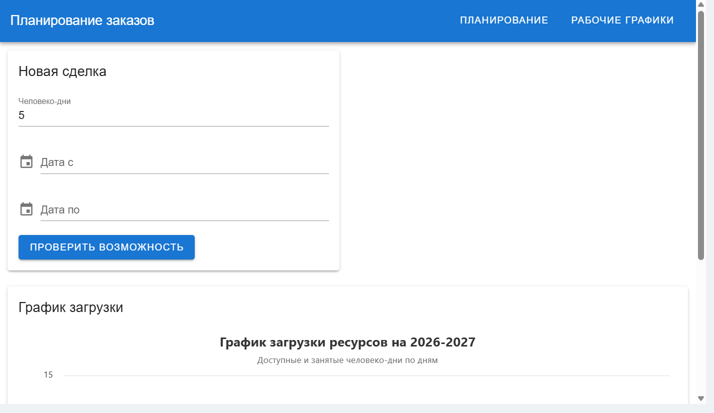
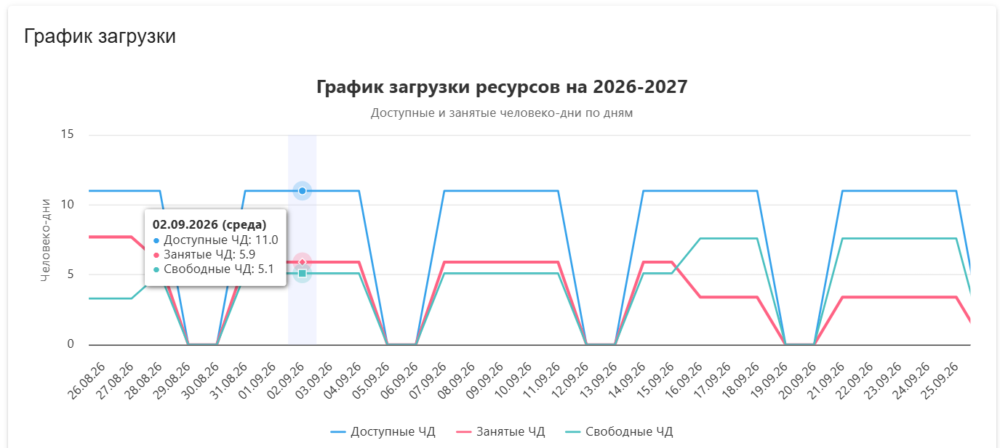
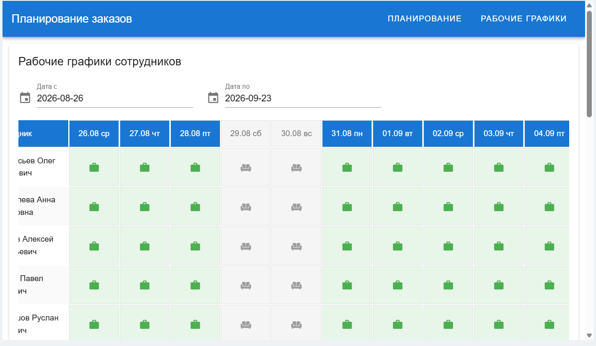
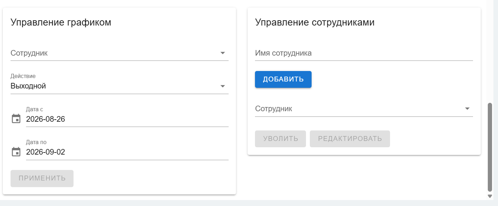
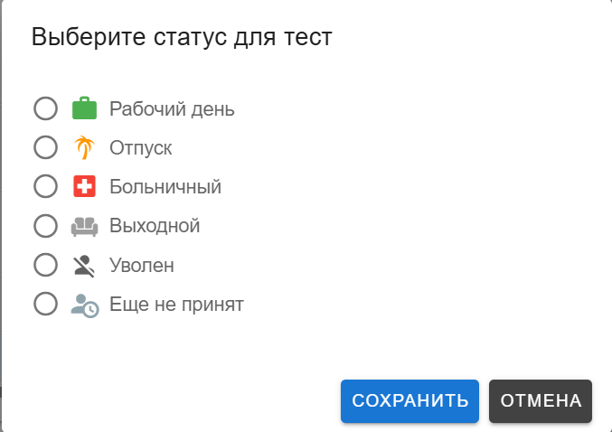
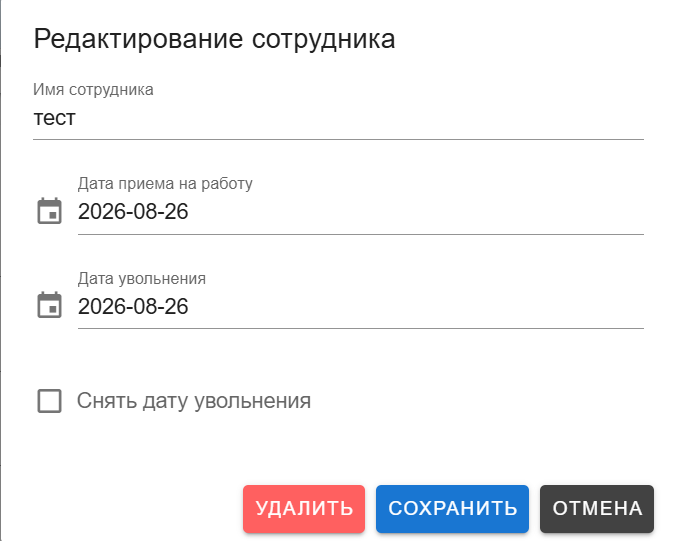

# Планирование заказов Bitrix24

Клиентское приложение для планирования загрузки сотрудников по сделкам Bitrix24. Показывает доступные и занятые человеко-дни, проверяет размещение новой сделки, ведёт рабочие графики и при перегрузке может продлевать дату окончания текущей сделки.

## Основные возможности

- Проверка новой сделки по человеко-дням и периоду.
- Запись расчётных дат и ЧД в текущую сделку Bitrix24.
- График загрузки ресурсов по дням.
- Учёт рабочих, выходных, отпусков, больничных, дат приёма и увольнения.
- Управление сотрудниками и их графиками.
- Производственный календарь с `isdayoff.ru`.
- Перераспределение перегрузки с изменением даты окончания только текущей сделки.

## Структура проекта

```text
shedule-test/
  frontend/                 # Vue 3 + Vite + Vuetify 3 + Pinia
    src/
      pages/                # PlanningPage, SchedulesPage
      components/           # формы, график, таблица, диалоги
      stores/appStore.js    # состояние и оркестрация
      domain/               # чистая логика (календарь, occupancy, redistribute)
      functions/            # callApi (BX24), apiClient (PHP)
      config/constants.js   # конфиг из .env
    env.example             # шаблон переменных окружения
    build.bat / start.bat
  backend/                  # PHP API + SQLite
    api/                    # employees.php, schedule.php, deals.php
    controllers/
    models/
    config/database.php
    database.sqlite
  docs/images/              # скриншоты UI
  README.md
```

## Стек

| Слой | Технологии |
|------|------------|
| Frontend | Vue 3, Vuetify 3, Pinia, Vite, Highcharts, Moment.js (ru), BX24 JS SDK |
| Backend | PHP 8, SQLite, JSON API `{ success, data\|error }` |
| Тесты | Vitest (`frontend/tests`) |

## Конфигурация (`.env`)

Секреты и адреса **не хранятся в коде**. Скопируйте шаблон:

```bat
cd frontend
copy env.example .env
```

| Переменная | Назначение |
|------------|------------|
| `VITE_API_BASE` | URL PHP API без завершающего `/` |
| `VITE_BITRIX24_WEBHOOK` | Входящий вебхук Bitrix24 (fallback без SDK) |
| `VITE_ADMIN_USER_ID` | ID пользователя с правами админа UI |
| `VITE_CRM_*` | Опционально: переопределение UF-полей сделки |

Значения подхватывает [`frontend/src/config/constants.js`](frontend/src/config/constants.js).

## Запуск и сборка

```bat
cd frontend
npm install
npm run dev
```

Или `install.bat` / `start.bat`.

Сборка для iframe Bitrix24:

```bat
cd frontend
build.bat
```

В `dist/build.zip` — статика с относительными путями `assets/`.

Тесты:

```bat
cd frontend
npm test
```

## Экраны

### Планирование

Доступен всем. Блок «Новая сделка» и график загрузки.





Пользователь вводит человеко-дни, дату начала и окончания → **Проверить возможность**. При успехе данные пишутся в текущую сделку, доступна кнопка **Добавить даты в сделку**.

### Рабочие графики

Только для администраторов (`BX24.isAdmin()` или `VITE_ADMIN_USER_ID`).










Можно:

- выбрать период таблицы;
- менять статус дня кликом по ячейке;
- массово применить статус на диапазон;
- добавить / уволить / отредактировать / удалить сотрудника.

Статусы: `working`, `weekend`, `vacation`, `sick`, `terminated`, `not_hired`.

## Интеграция с Bitrix24

SDK: `//api.bitrix24.com/api/v1/` (подключается в `frontend/index.html`).

Методы:

- `user.current`
- `crm.deal.list` / `crm.deal.update`
- `crm.timeline.comment.add`
- `BX24.placement.info().options.ID` — ID сделки в карточке

Если SDK недоступен, используется `VITE_BITRIX24_WEBHOOK`.

### Поля сделки (дефолты)

Расчёт загрузки (плановые; если пусто — подтверждённые):

| Ключ | UF (по умолчанию) | Назначение |
|------|-------------------|------------|
| `DEAL_START` | `UF_CRM_1784028802` | Дата начала |
| `DEAL_END` | `UF_CRM_1784028824` | Дата окончания |
| `DEAL_MAN_DAYS` | `UF_CRM_1784028978` | Человеко-дни |
| `DEAL_CONFIRMED_START` | `UF_CRM_1784028743` | Fallback начала |
| `DEAL_CONFIRMED_END` | `UF_CRM_1784028783` | Fallback окончания |

Запись результата проверки:

| Ключ | UF (по умолчанию) | Назначение |
|------|-------------------|------------|
| `DEAL_CALC_START` | `UF_CRM_1784028844` | Расчётная дата начала |
| `DEAL_CALC_END` | `UF_CRM_1784028947` | Расчётная дата окончания |
| `DEAL_CALC_MAN_DAYS` | `UF_CRM_1784029798` | Расчётные ЧД |

## Backend API

Базовый URL — `VITE_API_BASE` → каталог [`backend/api/`](backend/api/).

Логика в [`backend/controllers/`](backend/controllers/), данные в SQLite [`backend/database.sqlite`](backend/database.sqlite).

### `employees.php`

- `GET` — список сотрудников
- `POST` — добавить
- `PUT` — имя, дата приёма, дата увольнения
- `DELETE` — увольнение или полное удаление (`permanent: true`)

### `schedule.php`

- `GET ?start_date=&end_date=` — статусы за период
- `POST` — один день или `bulk_update`
- `DELETE` — увольнение через модель графика

### `deals.php`

- `GET` / `POST` / `DELETE` — локальное зеркало сделок  
Основной расчёт загрузки берёт сделки из Bitrix (`crm.deal.list`).

## Расчёт загрузки

Доступные ЧД на дату — число сотрудников, которые:

- уже приняты и не уволены на эту дату;
- не в отпуске / больничном / выходном;
- доступны по производственному календарю или явно отмечены как `working`.

Дневная нагрузка сделки (равномерно по **календарным** дням периода):

```text
дневная нагрузка = человеко-дни сделки / число календарных дней периода
```

Если равномерное распределение не влезает в ёмкость — динамическая симуляция: короткие сделки в приоритете, остаток дня добирают длинные.

Чистая логика: [`frontend/src/domain/`](frontend/src/domain/).

## Перераспределение перегрузки

`redistributeOverload()` после старта:

- берёт ID текущей сделки из placement;
- ищет перегруженные дни с участием этой сделки;
- переносит только её долю;
- при необходимости продлевает **только** её дату окончания.

Вне карточки сделки (нет ID) — шаг пропускается.

## Производственный календарь

```text
https://isdayoff.ru/api/getdata?year=<year>&delimeter=,
```

При сбое — календарь по умолчанию: Пн–Пт рабочие, Сб–Вс выходные.

## Размещение в Bitrix24

- Собранный frontend (`dist` / `build.zip`) отдаётся по HTTPS.
- Приложение или placement с правами на CRM-сделки.
- Backend API доступен по `VITE_API_BASE`.
- Для полной логики нужен `BX24` или настроенный вебхук.

Локальный `npm run dev` удобен для UI; CRM-вызовы без Bitrix/webhook ограничены.

## Частые сценарии

### Проверить сделку

1. Открыть приложение в карточке сделки.
2. Указать ЧД, даты начала и окончания.
3. **Проверить возможность**.
4. При успехе расчётные поля запишутся в сделку.

### Изменить график сотрудника

1. **Рабочие графики** → период таблицы.
2. Клик по ячейке → статус → сохранить.

### Массово применить статус

1. Выбрать сотрудника и действие.
2. Для обычных статусов указать период.
3. **Применить**.

## Сверка ЧД графика и таблицы

- Общий метод `isEmployeeAvailableForWork`.
- Строка **«Доступно ЧД»** в таблице должна совпадать с линией **«Доступные ЧД»** на графике.
- В консоль при обновлении графика — `verifyPersonnelChartConsistency`.
